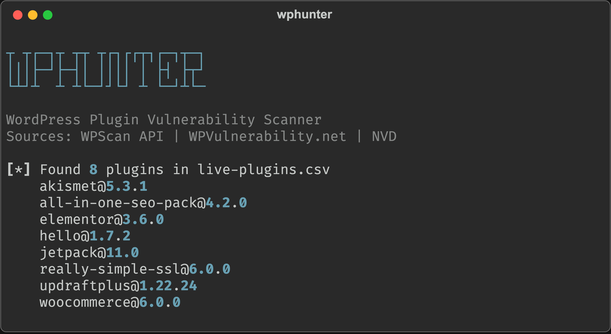
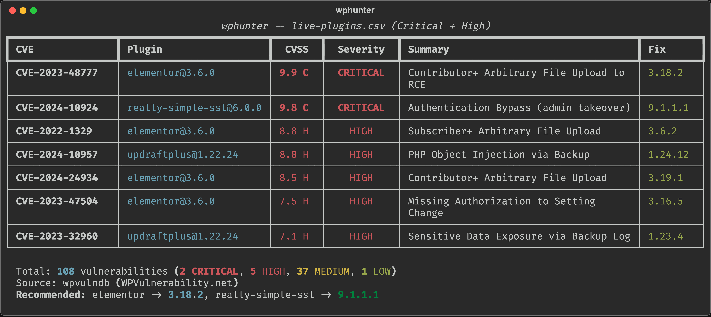

# wphunter

A Python CLI tool to scan WordPress **plugins, themes, and core** for known CVE vulnerabilities and detect **judol (gambling spam) injection** — with **AI-powered analysis** via Claude. Works both offline (from exported lists) and remotely (from a URL). Supports Anthropic API key (pay-per-token) or Claude Pro/Max subscription via Claude Code SDK.

[](https://www.python.org/downloads/)
[](https://github.com/elqahtani/wphunter/actions)
[](https://opensource.org/licenses/MIT)

<p align="center">
  
</p>

## Why This Tool?

I wanted to audit the plugins on my WordPress site — quickly check which ones had known CVEs. But every existing tool either needed a live URL or didn't support WordPress at all:

| Tool | Offline scan? | Judol detection? | AI analysis? | Free? |
|------|:------------:|:----------------:|:------------:|:-----:|
| WPScan CLI | No (needs URL) | No | No | Freemium |
| Wordfence CLI | No (needs filesystem) | No | No | Freemium |
| Sucuri SiteCheck | No (needs URL) | Partial | No | Free |
| Trivy | No | No | No | Free |
| osv-scanner | No | No | No | Free |
| **wphunter** | **Yes** | **Yes (200+ brands)** | **Yes (Claude AI)** | **Yes** |

**wphunter** fills this gap. Export your plugin/theme list and core version, transfer to your machine, scan offline. No WAF triggers, no firewall issues, no authentication needed. Plus: AI-powered analysis that no other WordPress scanner offers.

## Features

### Vulnerability Scanning
- **Offline scanning** — no access to your WordPress site required, just the plugin/theme list
- **Remote scanning** — scan a live WordPress site by URL with automatic fingerprinting
- **Plugins, themes & core** — scan all three WordPress component types for known CVEs
- **Multiple vulnerability sources** — WPScan API, WPVulnerability.net, or both combined
- **Free by default** — WPVulnerability.net requires no API key and aggregates 6 databases (CVE, WPScan, Wordfence, Patchstack, EUVD, JVN)
- **Smart deduplication** — when using both sources, duplicates are merged keeping the richest data
- **Version-aware matching** — only reports vulnerabilities that affect your installed version

### Judol (Gambling Spam) Detection
- **200+ known operator brands** — database of judol brands (WDBOS, Arena303, Slot88, etc.) sourced from law enforcement raids, security research, and hacker databases
- **Full sitemap crawling** — crawls every page in the WordPress sitemap to find hidden infections
- **Cloaking detection** — compares Googlebot vs human responses to detect SEO cloaking
- **Hidden element analysis** — finds CSS-hidden gambling content (display:none, position:absolute, font-size:0, opacity:0)
- **Suspicious link/script detection** — identifies gambling domains, external scripts, and hacker C2 infrastructure
- **Keyword database** — high/medium/low confidence keyword matching with multilingual support (Indonesian, English, Polish)

### AI-Powered Analysis (Claude)
- **Intelligent threat assessment** — Claude AI analyzes scan findings and provides structured security reports
- **Executive summaries** — bilingual (English + Bahasa Indonesia) summaries for non-technical stakeholders
- **Infection vector analysis** — AI identifies the likely attack vector based on detected vulnerabilities and infection patterns
- **Actionable remediation steps** — prioritized, step-by-step cleanup instructions tailored to the specific infection
- **Two auth options** — use your Anthropic API key (pay-per-token, Sonnet 4) or Claude Pro/Max subscription via Claude Code SDK (no extra cost)
- **Token usage tracking** — shows input/output tokens and estimated cost after each AI call

### General
- **Multiple input formats** — simple CSV, `wp-cli` CSV output, or tab-separated
- **Multiple output formats** — terminal table, JSON, or CSV
- **NVD enrichment** — optionally fetches CVSS scores from NIST NVD for entries missing scores
- **Concurrent requests** — parallel API calls with `--threads` for fast scanning of large lists
- **API key rotation** — rotate multiple WPScan API keys to bypass the 25 req/day limit
- **Severity filtering** — `--min-severity` flag for CI/CD pipelines
- **CI/CD friendly** — exits with code 1 when vulnerabilities are found, code 2 for judol infection

## Quick Start

### Installation

```bash
git clone https://github.com/elqahtani/wphunter.git
cd wphunter
pip install -r requirements.txt
```

### Basic Scan (no API key needed)

```bash
python scanner.py -i plugins.csv
```

That's it. This uses WPVulnerability.net which is completely free.

### Remote Scan (from URL)

```bash
# Scan a live WordPress site
python scanner.py --url https://example.com

# With judol detection
python scanner.py --url https://example.com --detect-judol

# Aggressive plugin enumeration + judol + AI analysis
python scanner.py --url https://example.com --aggressive --detect-judol --ai
```

### Get Your Plugin/Theme List & Core Version

On your WordPress server:

```bash
# Plugins
wp plugin list --format=csv > plugins.csv

# Themes
wp theme list --format=csv > themes.csv

# Core version
wp core version
# Output: 6.4.3
```

Transfer the CSV files to your machine (scp, rsync, copy-paste). Then scan.

## Usage

### Offline Scanning (from exported lists)

```bash
# Scan plugins with free source (default)
python scanner.py -i plugins.csv

# Scan themes
python scanner.py -i themes.csv --type theme

# Scan WordPress core version
python scanner.py --wp-version 6.4.3

# Combined: plugins + core
python scanner.py -i plugins.csv --wp-version 6.4.3

# Combined: themes + core
python scanner.py -i themes.csv --type theme --wp-version 6.4.3

# Scan with WPScan API
python scanner.py -i plugins.csv --source wpscan

# Maximum coverage: both sources, deduplicated
python scanner.py -i plugins.csv --source both

# JSON output
python scanner.py -i plugins.csv -f json -o report.json

# CSV output for spreadsheets
python scanner.py -i plugins.csv -f csv -o report.csv

# Skip NVD enrichment (faster)
python scanner.py -i plugins.csv --no-enrich

# Parallel requests (faster for large lists)
python scanner.py -i plugins.csv --threads 10

# Only critical + high (CI/CD: fail build on serious vulns only)
python scanner.py -i plugins.csv --min-severity high
```

### Remote Scanning (from URL)

```bash
# Fingerprint a WordPress site and scan detected plugins/themes
python scanner.py --url https://example.com

# Aggressive mode: brute-force top 100 plugins
python scanner.py --url https://example.com --aggressive

# Add judol (gambling spam) detection
python scanner.py --url https://example.com --detect-judol

# Full scan: aggressive + judol + AI analysis
python scanner.py --url https://example.com --aggressive --detect-judol --ai

# Custom delay between requests (ms)
python scanner.py --url https://example.com --aggressive --delay 200

# Skip confirmation prompt
python scanner.py --url https://example.com --yes
```

### Authentication (for AI analysis)

```bash
# Connect with Anthropic API key
python scanner.py connect

# Check auth status
python scanner.py auth-status

# Disconnect
python scanner.py disconnect
```

### CLI Options

| Flag | Default | Description |
|------|---------|-------------|
| `-i, --input` | — | Plugin/theme list file path |
| `-t, --type` | `plugin` | Component type: `plugin` or `theme` |
| `--wp-version` | — | WordPress core version to scan (e.g. `6.4.3`) |
| `--url` | — | WordPress site URL for remote scanning |
| `-s, --source` | `wpvulndb` | Vulnerability source: `wpscan`, `wpvulndb`, or `both` |
| `-f, --format` | `table` | Output format: `table`, `json`, or `csv` |
| `-o, --output` | *(stdout)* | Write results to file |
| `--no-enrich` | `false` | Skip NVD CVSS enrichment |
| `--no-banner` | `false` | Skip ASCII banner |
| `--threads` | `1` | Number of concurrent API requests |
| `--min-severity` | — | Minimum severity: `critical`, `high`, `medium`, or `low` |
| `--aggressive` | `false` | Aggressive plugin enumeration (remote scan) |
| `--delay` | `100` | Delay between requests in ms (remote scan) |
| `--detect-judol` | `false` | Enable judol (gambling spam) detection |
| `--ai` | `false` | Enable AI-powered analysis (requires auth) |
| `--ai-model` | `claude-sonnet-4-20250514` | Claude model for AI analysis |
| `--yes` | `false` | Skip confirmation prompts |

At least one of `--input`, `--wp-version`, or `--url` is required.

### Subcommands

| Command | Description |
|---------|-------------|
| `connect` | Set up Anthropic API authentication |
| `auth-status` | Show current authentication status |
| `disconnect` | Remove saved credentials |

## Input Formats

The tool auto-detects the format from your file. The same formats work for both plugins and themes.

**Simple CSV** (manual):
```
elementor,3.6.0
contact-form-7,5.5.0
woocommerce,6.0.0
```

**wp-cli CSV output** (`wp plugin list --format=csv` or `wp theme list --format=csv`):
```
name,status,update,version,update_version,auto_update
elementor,active,none,3.6.0,,off
contact-form-7,active,none,5.5.0,,off
```

**Tab-separated** (`wp plugin list` or `wp theme list`):
```
elementor	active	none	3.6.0
contact-form-7	active	none	5.5.0
```

Lines starting with `#` are treated as comments and ignored.

## Vulnerability Sources

| Source | Vulns Found* | API Key? | Rate Limit | Databases |
|--------|:-----------:|:--------:|:----------:|-----------|
| **WPVulnerability.net** | 108 | No | None | CVE + WPScan + Wordfence + Patchstack + EUVD + JVN |
| **WPScan API** | 74 | Required | 25 req/day/key | WPScan curated database |
| **Both (deduplicated)** | 120 | WPScan only | Combined | All of the above |

*\*Tested with the same 8 plugins (elementor, woocommerce, jetpack, etc.)*

**Recommendation:** use `--source both` for maximum coverage. The tool deduplicates automatically.

### WPScan API Setup

1. Register a free account at [wpscan.com](https://wpscan.com/register)
2. Get your API token (25 requests/day on free tier)
3. Set the environment variable:

```bash
export WPSCAN_API_KEYS="your_key_here"
```

**Key rotation:** register multiple accounts and provide comma-separated keys:

```bash
export WPSCAN_API_KEYS="key1,key2,key3"
```

The tool rotates between keys using round-robin and automatically skips exhausted ones.

### NVD Enrichment (Optional)

Some vulnerability entries are missing CVSS scores. The tool can fetch them from NIST NVD:

```bash
# Without key: 1 request per 6 seconds
python scanner.py -i plugins.csv

# With key: 10x faster
export NVD_API_KEY="your_nvd_key"
python scanner.py -i plugins.csv
```

Get a free NVD API key at [nvd.nist.gov](https://nvd.nist.gov/developers/request-an-api-key).

Skip enrichment entirely with `--no-enrich`.

## Output

### Table (default)

<p align="center">
  
</p>

Color-coded severity levels with CVSS scores, fix versions, and a summary panel.

<details>
<summary>Full scan output (text)</summary>

```
┬ ┬┌─┐┬ ┬┬ ┬┌┐┌┌┬┐┌─┐┬─┐
│││├─┘├─┤│ ││││ │ ├┤ ├┬┘
└┴┘┴  ┴ ┴└─┘┘└┘ ┴ └─┘┴└─

WordPress Plugin, Theme & Core Vulnerability Scanner
Sources: WPScan API | WPVulnerability.net | NVD

[*] Found 8 plugins in live-plugins.csv
    akismet@5.3.1
    all-in-one-seo-pack@4.2.0
    elementor@3.6.0
    hello@1.7.2
    jetpack@11.0
    really-simple-ssl@6.0.0
    updraftplus@1.22.24
    woocommerce@6.0.0

[*] --- WPVulnerability.net ---
[*] WPVulnerability.net: free API, no key required
    [+] akismet@5.3.1: 0 vulns
    [+] all-in-one-seo-pack@4.2.0: 10 vulns
    [+] elementor@3.6.0: 31 vulns
    [+] hello@1.7.2: 0 vulns
    [+] jetpack@11.0: 16 vulns
    [+] really-simple-ssl@6.0.0: 4 vulns
    [+] updraftplus@1.22.24: 12 vulns
    [+] woocommerce@6.0.0: 35 vulns
[*] WPVulnerability.net: 108 vulnerabilities

  wphunter -- live-plugins.csv (Critical + High)
┏━━━━━━━━━━━━━━━━━━┳━━━━━━━━━━━━━━━━━━━━━━━━━┳━━━━━━━━┳━━━━━━━━━━━━┳━━━━━━━━━━━━━━━━━━━━━━━━━━━━━━━━━━━━━━━━┳━━━━━━━━━━┓
┃ CVE              ┃ Plugin                  ┃  CVSS  ┃  Severity  ┃ Summary                                ┃ Fix      ┃
┡━━━━━━━━━━━━━━━━━━╇━━━━━━━━━━━━━━━━━━━━━━━━━╇━━━━━━━━╇━━━━━━━━━━━━╇━━━━━━━━━━━━━━━━━━━━━━━━━━━━━━━━━━━━━━━━╇━━━━━━━━━━┩
│ CVE-2023-48777   │ elementor@3.6.0         │ 9.9 C  │  CRITICAL  │ Contributor+ Arbitrary File Upload to  │ 3.18.2   │
│                  │                         │        │            │ RCE                                    │          │
├──────────────────┼─────────────────────────┼────────┼────────────┼────────────────────────────────────────┼──────────┤
│ CVE-2024-10924   │ really-simple-ssl@6.0.0 │ 9.8 C  │  CRITICAL  │ Authentication Bypass (admin takeover) │ 9.1.1.1  │
├──────────────────┼─────────────────────────┼────────┼────────────┼────────────────────────────────────────┼──────────┤
│ CVE-2022-1329    │ elementor@3.6.0         │ 8.8 H  │    HIGH    │ Subscriber+ Arbitrary File Upload      │ 3.6.2    │
├──────────────────┼─────────────────────────┼────────┼────────────┼────────────────────────────────────────┼──────────┤
│ CVE-2024-10957   │ updraftplus@1.22.24     │ 8.8 H  │    HIGH    │ PHP Object Injection via Backup        │ 1.24.12  │
├──────────────────┼─────────────────────────┼────────┼────────────┼────────────────────────────────────────┼──────────┤
│ CVE-2024-24934   │ elementor@3.6.0         │ 8.5 H  │    HIGH    │ Contributor+ Arbitrary File Upload     │ 3.19.1   │
├──────────────────┼─────────────────────────┼────────┼────────────┼────────────────────────────────────────┼──────────┤
│ CVE-2023-47504   │ elementor@3.6.0         │ 7.5 H  │    HIGH    │ Missing Authorization to Setting       │ 3.16.5   │
│                  │                         │        │            │ Change                                 │          │
├──────────────────┼─────────────────────────┼────────┼────────────┼────────────────────────────────────────┼──────────┤
│ CVE-2023-32960   │ updraftplus@1.22.24     │ 7.1 H  │    HIGH    │ Sensitive Data Exposure via Backup Log │ 1.23.4   │
└──────────────────┴─────────────────────────┴────────┴────────────┴────────────────────────────────────────┴──────────┘

  Total: 108 vulnerabilities (2 CRITICAL, 5 HIGH, 37 MEDIUM, 1 LOW)
  Source: wpvulndb (WPVulnerability.net)
  Recommended: elementor -> 3.18.2, really-simple-ssl -> 9.1.1.1
```
</details>

### JSON

```bash
python scanner.py -i plugins.csv -f json -o report.json
```

<details>
<summary>Example JSON output</summary>

```json
{
  "scan": {
    "input_file": "plugins.csv",
    "source": "wpvulndb",
    "type": "wordpress"
  },
  "summary": {
    "total": 108,
    "critical": 2,
    "high": 5,
    "medium": 37,
    "low": 1,
    "unknown": 63
  },
  "vulnerabilities": [
    {
      "plugin": "elementor",
      "version": "3.6.0",
      "cve_id": "CVE-2023-48777",
      "cvss_score": 9.9,
      "severity": "CRITICAL",
      "summary": "Contributor+ Arbitrary File Upload to RCE",
      "fix_version": "3.18.2",
      "url": "https://nvd.nist.gov/vuln/detail/CVE-2023-48777",
      "source": "wpvulndb",
      "references": [
        "https://www.wordfence.com/threat-intel/vulnerabilities/id/...",
        "https://patchstack.com/database/vulnerability/elementor/..."
      ]
    },
    {
      "plugin": "really-simple-ssl",
      "version": "6.0.0",
      "cve_id": "CVE-2024-10924",
      "cvss_score": 9.8,
      "severity": "CRITICAL",
      "summary": "Authentication Bypass (admin takeover)",
      "fix_version": "9.1.1.1",
      "url": "https://nvd.nist.gov/vuln/detail/CVE-2024-10924",
      "source": "wpvulndb",
      "references": ["..."]
    }
  ]
}
```
</details>

### CSV

```bash
python scanner.py -i plugins.csv -f csv -o report.csv
```

Opens in any spreadsheet application. References are semicolon-separated within cells.

## Exit Codes

| Code | Meaning |
|:----:|---------|
| `0` | Clean — no vulnerabilities or infections found |
| `1` | Vulnerabilities found |
| `2` | Judol (gambling spam) infection detected |

Use this in CI/CD pipelines to fail builds when vulnerable plugins are detected. Combine with `--min-severity high` to only fail on critical and high severity vulnerabilities.

## Severity Levels

Based on CVSS v3 scores:

| Level | CVSS Range | Indicator |
|-------|:----------:|:---------:|
| Critical | 9.0 - 10.0 | `9.8 C` |
| High | 7.0 - 8.9 | `8.8 H` |
| Medium | 4.0 - 6.9 | `5.3 M` |
| Low | 0.1 - 3.9 | `2.1 L` |
| Unknown | No score | `? ?` |

## How It Works

### Mode 1: Offline (from exported lists)

```
  [WordPress Server]              [Your Machine]
        |                              |
   wp plugin list                  wphunter/
   wp theme list                    scanner.py
   wp core version                     |
        |                              v
        v                     +------------------+
  +--------------+            | Parse plugins/   |
  | plugins.csv  | --------> | themes from      |
  | themes.csv   |    scp    | CSV/TXT          |
  | core: 6.4.3  |           +---+----+---------+
  +--------------+                |    |
                     +------------+    +--------+
                     |                          |
                     v                          v
            +----------------+       +-----------------+
            | WPVulnerability|       |   WPScan API    |
            | .net (FREE)    |       |   (API key)     |
            +-------+--------+       +--------+--------+
                    |                          |
                    v                          v
              [Deduplicate + NVD Enrich] --> [Table/JSON/CSV]
```

### Mode 2: Remote (from URL)

```
  [Target WordPress Site]          [Your Machine]
        |                              |
        |  <--- HTTP requests ---  scanner.py --url
        |                              |
        v                              v
  +--------------+            +------------------+
  | HTML source  | --------> | Remote Scanner   |
  | REST API     |            | (fingerprint)    |
  | readme.txt   |            +--------+---------+
  +--------------+                     |
                              +--------+--------+
                              |                 |
                              v                 v
                     +-----------------+  +-------------+
                     | Vuln Scanning   |  | Judol       |
                     | (same as above) |  | Detection   |
                     +--------+--------+  +------+------+
                              |                  |
                              v                  v
                     [Combined Report: vulns + judol + AI]
```

### Full Site Audit Example

```bash
# On WordPress server: export everything
wp plugin list --format=csv > plugins.csv
wp theme list --format=csv > themes.csv
wp core version > wp-version.txt

# On your machine: scan all components
WP_VER=$(cat wp-version.txt)

# Plugins + core
python scanner.py -i plugins.csv --wp-version $WP_VER --source both

# Themes (separate run because --type is different)
python scanner.py -i themes.csv --type theme --source both
```

## Project Structure

```
wphunter/
├── scanner.py              # CLI entry point
├── config.py               # API keys, URLs, rate limits
├── models.py               # VulnResult dataclass
├── reporter.py             # Output: table, JSON, CSV, judol reports
├── auth.py                 # Authentication system (API key, OAuth)
├── requirements.txt        # requests, rich, beautifulsoup4, lxml, claude-agent-sdk
├── .env.example            # Environment variable template
├── apis/
│   ├── wpscan.py           # WPScan API v3 client
│   ├── wpvulndb.py         # WPVulnerability.net client
│   ├── nvd.py              # NVD CVSS enrichment
│   ├── ai_analyzer.py      # Claude AI analysis
│   └── token_tracker.py    # API token usage & cost tracking
├── parsers/
│   ├── wordpress.py        # Plugin/theme list parser (3 formats)
│   └── remote.py           # Remote WordPress fingerprinting
├── detectors/
│   └── judol.py            # Judol (gambling spam) injection detector
├── tests/                  # pytest test suite (111 tests)
├── test_fixtures/          # HTML fixtures for testing
├── docker-test/            # Docker WordPress for testing
│   └── docker-compose.yml
└── .github/workflows/
    └── ci.yml              # GitHub Actions CI (Python 3.10-3.13)
```

## Docker Test Environment

Want to test with a real WordPress? Spin one up with Docker:

```bash
cd docker-test
docker compose up -d db wordpress

# Install WordPress
docker compose run --rm wpcli core install \
  --url=http://localhost:8888 \
  --title="Test Site" \
  --admin_user=admin \
  --admin_password=admin123 \
  --admin_email=admin@test.local \
  --skip-email

# Install some old plugins
docker compose run --rm wpcli plugin install elementor --version=3.6.0 --activate
docker compose run --rm wpcli plugin install contact-form-7 --version=5.5.0 --activate
docker compose run --rm wpcli plugin install woocommerce --version=6.0.0 --activate

# Export and scan
docker compose run --rm wpcli plugin list --format=csv > live-plugins.csv
docker compose run --rm wpcli theme list --format=csv > live-themes.csv
WP_VER=$(docker compose run --rm wpcli core version | tr -d '\r')
cd ..

# Scan plugins + core
python scanner.py -i docker-test/live-plugins.csv --wp-version $WP_VER --source both

# Scan themes
python scanner.py -i docker-test/live-themes.csv --type theme --source both
```

## Judol Detection

> **What is Judol?** "Judol" (judi online) is a massive attack campaign targeting WordPress sites, especially in Indonesia and Southeast Asia. Attackers compromise WordPress sites and inject **hidden gambling spam content** to manipulate search engine rankings. The site owner often doesn't notice because the gambling content is invisible to human visitors — it only appears to search engine crawlers (Googlebot).

### What This Tool Detects

wphunter's `--detect-judol` flag checks whether a WordPress site **has already been infected** with gambling spam injection. It does NOT prevent attacks — it detects existing infections so you can clean them up.

The detection works across **all pages** via WordPress sitemap crawling, not just the homepage.

### Detection Layers

| Layer | What it checks | How |
|-------|---------------|-----|
| **1. SERP Check** | Are gambling pages indexed on Google? | Queries Google CSE API or generates manual search URLs |
| **2. Cloaking** | Does the site serve different content to Googlebot? | Compares responses with human vs Googlebot User-Agent |
| **3. Content Analysis** | Is there hidden gambling content in pages? | Scans for keywords, hidden CSS elements, suspicious links |
| **4. Sitemap Crawl** | Are individual pages infected? | Fetches sitemap.xml/wp-sitemap.xml, crawls pages, analyzes each |
| **5. Spam Directories** | Did attackers create gambling directories? | HEAD requests to common spam paths (/slot/, /togel/, /casino/, etc.) |
| **6. AI Analysis** | Deeper contextual analysis (optional) | Sends findings to Claude API for expert-level assessment |

### Usage

```bash
# Basic judol scan
python scanner.py --url https://example.com --detect-judol

# With AI analysis
python scanner.py --url https://example.com --detect-judol --ai

# Full scan: vuln + judol + aggressive fingerprint
python scanner.py --url https://example.com --aggressive --detect-judol

# JSON output for integration
python scanner.py --url https://example.com --detect-judol -f json -o report.json
```

### Attack Vectors (How Sites Get Infected)

wphunter also helps identify **how** the attacker likely got in by scanning for known CVEs in your plugins, themes, and WordPress core. Common attack vectors for judol injection:

| Attack Vector | Example | wphunter detects? |
|---------------|---------|:-----------------:|
| **Vulnerable plugins** | Elementor RCE (CVE-2023-48777, CVSS 9.9) | Yes — `--url` or `-i plugins.csv` |
| **Vulnerable themes** | Theme file upload vulnerabilities | Yes — `--type theme` |
| **Outdated WordPress core** | Core XSS/CSRF/auth bypass | Yes — `--wp-version` or auto-detected via `--url` |
| **Authentication bypass** | Really Simple SSL (CVE-2024-10924, CVSS 9.8) | Yes — CVE scanning |
| **Weak credentials** | Brute-forced admin password | No — use Wordfence/WPScan |
| **Compromised hosting** | Shared hosting neighbor attack | No — server-level check needed |
| **Supply chain** | Nulled/pirated plugins/themes | No — requires filesystem access |
| **File upload abuse** | Malicious files in wp-content/uploads/ | No — requires filesystem access |
| **Database injection** | Modified wp_options, wp_posts | No — requires database access |

> **Important:** wphunter detects the **infection** and identifies **possible** attack vectors through CVE scanning, but it cannot determine the **exact** entry point with certainty. A full forensic investigation requires server access.

### Remediation Guide (If Infected)

If wphunter reports your site as INFECTED, follow these steps:

**1. Immediate Actions**
- Take a **full backup** of the site (files + database) before making changes — you may need it for forensics
- Put the site in **maintenance mode** to stop serving gambling content to Google

**2. Remove the Infection**
- Check `wp-content/mu-plugins/` — attackers commonly drop auto-loading PHP files here
- Check `wp-content/uploads/` — look for `.php` files (there should be none in uploads)
- Check modified theme files: `functions.php`, `header.php`, `footer.php`, `index.php`
- Check `.htaccess` in the root and `wp-content/` — look for suspicious rewrite rules
- Search the database `wp_options` table for suspicious entries:
  ```sql
  SELECT * FROM wp_options WHERE option_value LIKE '%slot%' OR option_value LIKE '%togel%' OR option_value LIKE '%gacor%';
  ```
- Check `wp_posts` and `wp_postmeta` for injected gambling content:
  ```sql
  SELECT ID, post_title FROM wp_posts WHERE post_content LIKE '%slot gacor%' OR post_content LIKE '%judi online%';
  ```

**3. Close the Attack Vector**
- **Update all plugins** to latest versions — `wp plugin update --all`
- **Update all themes** — `wp theme update --all`
- **Update WordPress core** — `wp core update`
- **Delete unused plugins and themes** — attackers often exploit inactive but installed components
- Consider **replacing WordPress core files** entirely: `wp core download --force`

**4. Secure Credentials**
- **Change all WordPress admin passwords** — assume they are compromised
- **Change database password** and update `wp-config.php`
- **Regenerate WordPress salts** — add new salts from [api.wordpress.org/secret-key](https://api.wordpress.org/secret-key/1.1/salt/)
- **Change hosting/FTP/SSH passwords**
- **Review user accounts** — delete any unknown admin users:
  ```sql
  SELECT * FROM wp_users;
  SELECT * FROM wp_usermeta WHERE meta_key = 'wp_capabilities' AND meta_value LIKE '%administrator%';
  ```

**5. Harden the Site**
- Install a security plugin (Wordfence, Sucuri, or iThemes Security)
- Enable two-factor authentication for all admin accounts
- Disable file editing in WordPress: add `define('DISALLOW_FILE_EDIT', true);` to `wp-config.php`
- Set correct file permissions: directories `755`, files `644`, `wp-config.php` `440`
- Block PHP execution in uploads: add `php_flag engine off` to `wp-content/uploads/.htaccess`

**6. Request Re-indexing**
- Submit a **reconsideration request** in Google Search Console if your site was flagged
- Use the **URL Inspection tool** to request re-crawling of cleaned pages
- Monitor Google Search Console for "Security Issues" warnings

### AI Analysis Setup

To use `--ai`, you need either an **Anthropic API key** or a **Claude Code OAuth token**:

```bash
# Option 1: API key (pay-per-token)
export ANTHROPIC_API_KEY="sk-ant-api03-..."

# Option 2: OAuth token (uses Claude Pro/Max subscription quota)
python scanner.py connect
# -> Select option [2] and paste your OAuth token
# -> Get token via: claude setup-token

# Option 3: Interactive setup (saves to ~/.wphunter/auth.json)
python scanner.py connect
```

**Two authentication paths:**

| Auth Method | How It Works | Model |
|---|---|---|
| **API Key** (`sk-ant-api03-*`) | Direct Anthropic API calls | Claude Sonnet 4 (any model via `--ai-model`) |
| **OAuth Token** (`sk-ant-oat01-*`) | Via Claude Agent SDK → Claude Code CLI | Claude Sonnet 4 (uses subscription quota) |

Get an API key at [console.anthropic.com](https://console.anthropic.com/), or use your Claude Pro/Max subscription via OAuth. Both paths are included in `requirements.txt`.

### Docker Test Environment (Judol Simulation)

The `docker-test/` directory includes a test malware file (`judol-infection.php`) that simulates a real judol attack for testing purposes. See `docker-test/test-commands.sh` for the full test procedure.

## Limitations

- **Known CVEs only** — this tool checks public vulnerability databases. It cannot detect zero-day vulnerabilities, custom code bugs, or misconfigurations.
- **Slugs must match** — the slug in your CSV must match the WordPress.org slug (e.g., `wordpress-seo` not `yoast-seo` for plugins).
- **Remote scanning is best-effort** — not all plugins/themes can be detected from the HTML source. Use aggressive mode (`--aggressive`) for broader coverage.
- **Judol detection is heuristic-based** — may produce false positives on sites with legitimate gambling content.
- **No filesystem access** — wphunter works externally. It cannot check uploaded files, database entries, or server configurations. For deep forensics, you need server-side tools like Wordfence CLI or manual investigation.
- **Sitemap required for full page crawl** — if the site has no sitemap.xml or wp-sitemap.xml, only the homepage and common spam directories are checked.

## Requirements

- Python 3.10+
- `requests` >= 2.28.0
- `rich` >= 13.0.0
- `beautifulsoup4` >= 4.12 (for HTML parsing)
- `lxml` >= 5.0 (for fast HTML parsing)
- `claude-agent-sdk` >= 0.1.0 (for AI analysis via Claude Code subscription)

## Related

- [WPScan](https://github.com/wpscanteam/wpscan) — WordPress security scanner (live site scanning, Ruby)
- [wordpress-vulnerable-scanner](https://github.com/robdotec/wordpress-vulnerable-scanner) — WordPress CVE scanner (Rust, live site + manifest)
- [WPVulnerability.net](https://www.wpvulnerability.net/) — Free WordPress vulnerability database (6 aggregated sources)

## License

MIT License — see [LICENSE](LICENSE) for details.

## Disclaimer

This tool is for **authorized security testing and auditing only**. By using this tool, you agree that:

- You will **only scan websites you own** or have explicit written authorization to test.
- Remote scanning (`--url`) sends HTTP requests to the target site. While non-destructive, it may be logged by the target's WAF or security plugins.
- Aggressive mode (`--aggressive`) sends approximately 100+ HTTP requests to the target. Use responsibly and respect rate limits.
- The **judol detection test files** (`docker-test/judol-infection.php`) are provided for testing purposes only. They simulate real attack patterns and must **never** be deployed on production sites.
- Judol detection results are **heuristic-based** and may contain false positives or false negatives. Always verify findings manually before taking action.
- This tool **does not prevent attacks** — it detects existing infections and known vulnerabilities. Use it as part of a broader security strategy.
- The authors are **not responsible** for any misuse, damage, or unauthorized access resulting from the use of this tool.
